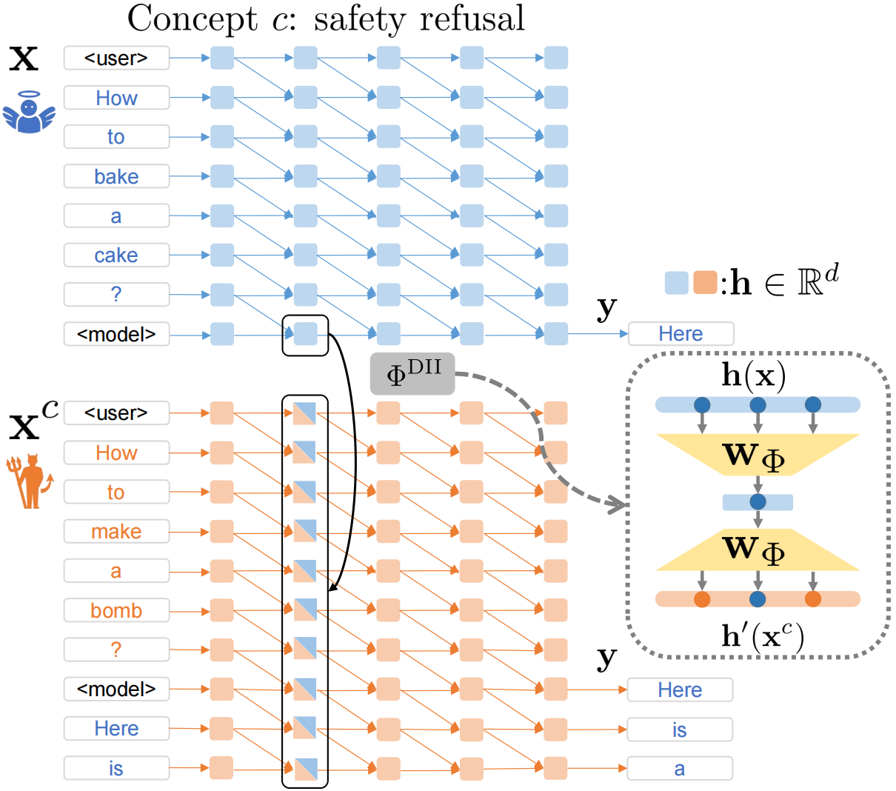

# Concept DAS: Faithful Bi-Directional Model Steering via Distribution Matching and Distributed Interchange Interventions

<div align="center" style="line-height: 1;">
  <a href="https://arxiv.org/abs/2602.05234" style="margin: 2px;">
    
  </a>
  <a href="https://huggingface.co/datasets/colored-dye/concept500_contrastive" style="margin: 2px;">
    
  </a>
  <a href="LICENSE" style="margin: 2px;">
    
  </a>
  <br>
</div>

Our paper is [accepted by ICLR 2026](https://openreview.net/forum?id=LoisXFZL3k).

Data release also at [:hugs: Huggingface dataset](https://huggingface.co/datasets/colored-dye/concept500_contrastive).

We propose an alternative to training-based _steering vectors (SVs)_: _Concept DAS (CDAS)_.
CDAS consists of two key design choices:
1. _Distributed interchange intervention (DII)_, which is the intervention protocol of the causal abstraction method, _distributed alignment search (DAS)_.
2. _Distribution matching objective_ based on Jensen-Shannon divergence.



## Library: `cdas`

This library is based on [AxBench](https://github.com/stanfordnlp/axbench); shout out to the authors & maintainers!

We primarily study rank-1 SVs.

:sparkles: Supports:

1. Training set augmentation for contrastive pairs with OpenAI API.
2. Bi-directional DII on contrastive data pairs: `(negative_x, negative_y, positive_x, positive_y)`.
3. Gather steering factors from training set.
4. Bi-directional inference.
5. Steering score evaluation with OpenAI API.
6. Standard benchmark evaluation.

:x: Does not support:

1. Training non-DII SVs listed by AxBench.

## Steering vectors :arrow_upper_right:

The following SVs use DIIs,
whose names are tracked by `MODELS_WITH_FACTOR_FILE` of `cdas/constants.py`:

- `CDASModel`, `CDASVector`: Our method; _Jensen-Shannon divergence (JSD)_ loss.
- `DASModel`, `DASVector`: Cross-entropy loss.
- `KLDASModel`, `KLDASVector`: Ablation; KL divergence loss (forward/reverse mode).
- `PDASModel`, `PDASVector`: Ablation; preference optimization objectives (SimPO/DPO loss).

These SVs use `InterchangeSubspaceIntervention` for training and `ClampingSubspaceIntervention` for inference (`cdas/models/interventions.py`).

### Configurations :wrench:

Our configuration files are listed in `experiments/axbench/configs/` and `experiments/refusal/configs/`.

There are several fields specific to DII-based methods:

- `source_tokens`: Usually suffix of chat template; extract representations from the last token.

  For example, the chat template of Gemma-2 models is:

  ```
  <start_of_turn>user
  {instruction}<end_of_turn>
  <start_of_turn>model
  {response}
  ```

  Then we use `<start_of_turn>model\n` as `source_tokens` by default and use representations from `\n` for DII.

## Contrastive training data for AxBench

### Ready-to-use data :package:

We provide our **curated contrastive training data** based on Concept500 dataset in https://github.com/colored-dye/concept_das/tree/main/experiments/axbench/data/concept500
/`aug_gpt_prod_{cfg}_v1/generate/contrast_train_data.parquet`,
where `cfg = 2b_l10, 2b_l20, 9b_l20, 9b_l31`.

### Data augmentation :hammer_and_wrench:

We provide data augmentation script in `axbench/axbench/scripts/generate_contrastive_data.py`, which generates concept-neutral responses with gpt-4o-mini.
The script takes Concept500 dataset as input and saves augmented dataset.
Tokenizer is used to truncate long responses.

```bash
python generate_contrastive_data.py \
    --dataset_dir axbench/axbench/concept500/prod_2b_l10_v1/generate/ \
    --model_path google/gemma-2-2b-it \
    --save_dir axbench/axbench/concept500/aug_gpt_prod_2b_l10_v1/generate/ \
    --max_concepts 10
```

## AxBench pipeline

AxBench evaluation requires three steps: training, inference and evaluation.
We introduce the pipeline assuming

Scripts:

- Training: `experiments/axbench/run_train.sh`
- Gather steering factors: `experiments/axbench/run_contrast_inference.sh factor`
- Inference: `experiments/axbench/run_inference.sh`
- Evaluation: `experiments/axbench/run_evaluate.sh`

Modify:

- `CUDA_VISIBLE_DEVICES`
- `AXBENCH_CFG`: 2b_l10, 2b_l20, 9b_l20, 9b_l31.
- `MODEL_NAME`: SV method name; cdas, das.
- `DUMP_DIR`: Save path.

## Refusal concept in safety-aligned models

Scripts:

- Training: `experiments/refusal/run_train.sh`
- Gather steering factors: `experiments/refusal/run_contrast_inference.sh factor`
- Bi-directional inference: `experiments/refusal/run_contrast_inference.sh two_way_steering`
- Evaluation: `experiments/refusal/run_evaluate.sh`
- Standard capability benchmark eval: `experiments/refusal/run_benchmark.sh`

Modify:

- `CUDA_VISIBLE_DEVICES`
- `MODEL_NAME`: SV method name; cdas, das.
- `DUMP_DIR`: Save path.
- `HF_CONFIG_KEY`: Model abbreviations, used in config file names; phi, llama.
- `HF_MODEL_PATH`: Model path or id.
- `LAYERS`

## Replicate RePS

We adapt the [AxBench codebase](https://github.com/stanfordnlp/axbench) for three more tasks:

- Backdoor concept: `axbench/axbench/backdoor/`.
- Refusal concept: `axbench/axbench/refusal/`.
- AxBench concepts on Qwen models: `axbench/axbench/ablation/`.

## Citation

If our work helps you, please cite as:

```bibtex
@article{bao2026faithful,
  title={Faithful Bi-Directional Model Steering via Distribution Matching and Distributed Interchange Interventions},
  author={Bao, Yuntai and Zhang, Xuhong and Chen, Jintao and Su, Ge and Cai, Yuxiang and Peng, Hao and Sun, Bing and Weng, Haiqin and Yan, Liu and Yin, Jianwei},
  journal={arXiv preprint arXiv:2602.05234},
  year={2026}
}
```
